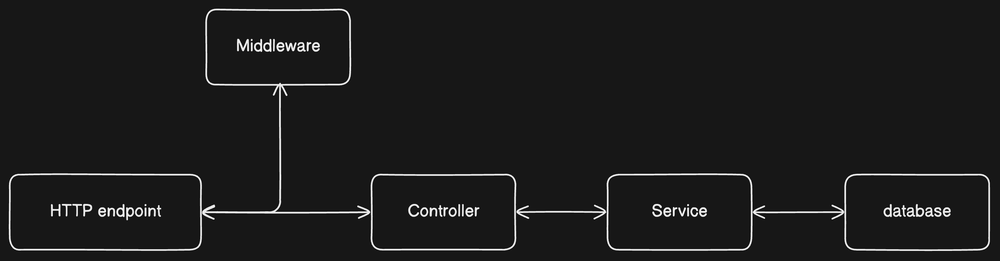
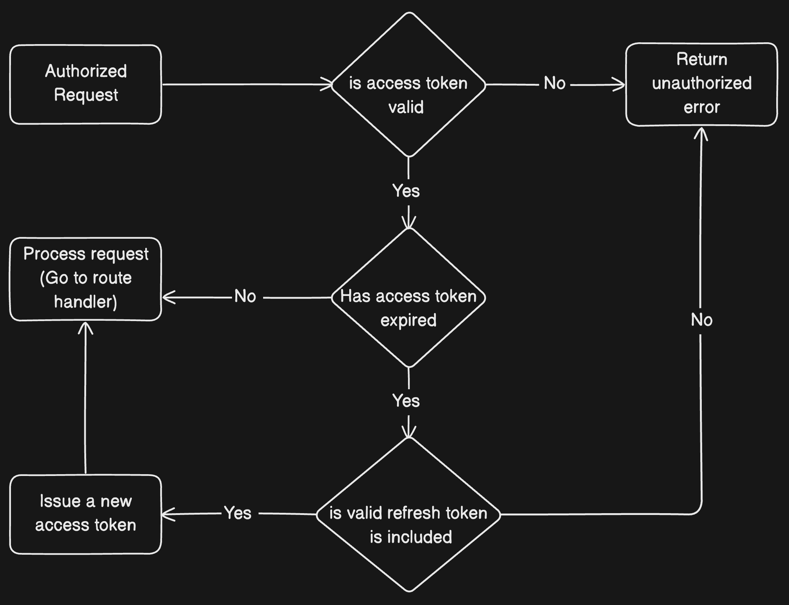

# 💻 NodeMart: A RESTful API with User Registration, Authentication, and Product Management

This project aims on building a TypeScript-powered REST API using Node.js and MongoDB with Mongoose. 
project includes user authentication with JWT tokens, CRUD operations for users and products, along 
with comprehensive testing using Jest. Additionally, it incorporates Google OAuth integration for enhanced security.

## 🚀 Features

* User can
    * create account
    * login session 
    * logout session
* product can be created, updated, read, delete
* tokens
    * refresh tokens
    * jwt token
* CRUD Operations on db
* MongoDB Integration
* Request Validation
* Jest Testing
* Prometheus Metrics
* Caddy & Docker Deployment
* Google OAuth Integration
* Middleware Implementation

## 🛠️ Main Technologies
- `Typescript`
* `Node.js`
* `MongoDB with Mongoose`
* `Express.js & Express.js middleware`
* `Zod validation`

## 📝 Process

I began by outlining the desired features for the project, drawing inspiration from existing REST APIs and best practices in web development.

First, I established user registration functionality, ensuring secure account creation and storage in MongoDB. Then, I implemented JWT-based user authentication to manage user sessions effectively.

I also used postman for testing locally.

Next, I focused on developing CRUD operations for both user and product entities, integrating MongoDB with Mongoose for seamless data management.

To maintain data integrity and security, I implemented request validation mechanisms, validating incoming data against predefined schemas using Zod.

For comprehensive testing, I employed Jest to thoroughly test API endpoints, ensuring robustness and reliability in operation.

To monitor and analyze API performance, I integrated Prometheus metrics, enabling real-time performance tracking and optimization.

For deployment, I utilized Caddy and Docker to streamline the deployment process, ensuring scalability and reliability in production environments.

Finally, I integrated Google OAuth for enhanced security and user authentication options, adding an additional layer of protection to the API endpoints.

Throughout the development process, attention was paid to middleware implementation, ensuring proper session management, request parsing, and user authorization.

## 🤔 How Can It Be Improved?
So far, I'm not really sure if there are any bugs. there might be improvement ,consider implementing rate limiting and logging mechanisms to improve security and monitor API usage effectively. Additionally, incorporating automated CI/CD pipelines for seamless integration and deployment can further streamline development workflows and ensure continuous delivery of updates.

## Data flow

## Access & refresh token flow

# Deployment
## What will i use
* Docker (image)
* docker-compose (container)
* Caddy - Web server
* DigitalOcean

## Let's keep in touch
- [Twitter](https://twitter.com/saikiran_arch)
- [LinkedIn](https://www.linkedin.com/in/saikiranannam)